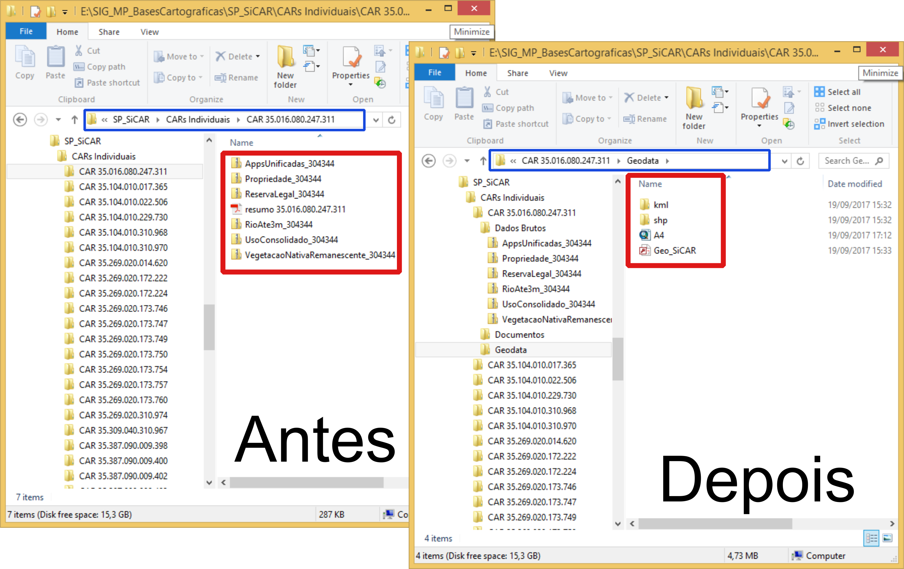

# ArcGIS-SiCAR
Conjunto de Scripts para analisar os shapefiles, KMLs e PDFs extraídos da plataforma SiCAR, da Secretaria do Meio Ambiente do Estado de São Paulo.

## Para que serve?
A partir de uma necessidade de analisar todos os Cadastros Ambientais Rurais de uma usina de cana-de-açúcar, composta por várias propriedades rurais e, portanto vários CARs distintos, decidi escrever um código que analisasse o material disponibilizado pela Secretaria do Meio Ambiente do Estado de São Paulo.

Inicialmente (*Etapa_1_CARs_Individuais.py*) buscava que os diversos arquivos zipados, contendo *shapefiles* e outros arquivos, fossem automaticamente transformados em uma base de dados do ArcGIS (*geodatabase*), com a edição inclusive das tabelas de atributos.

Posteriormente (*Etapa_2_CARs_Somados.py*) necessitava que todos os diversos CARs fossem unidos em apenas uma base de dados, facilitando análises e interpretações.

### Etapa_1_CARs_Individuais.py
Script elaborado para organizar os shapefiles, arquivos KML/KMZ e PDFs exportados pelo [SiCAR](http://www.ambiente.sp.gov.br/sicar/), da SMA.
A análise é feita em lote, ou seja, todos os CARs que estiverem dentro de uma dada pasta serão analisados.

O nome das subpastas deve conter, obrigatoriamente, o número do CAR sendo que QUAISQUER OUTROS CARACTERES SERÃO IGNORADOS! *Por exemplo: para a pasta com nome de "CAR 35.458.030.247.579" será utilizado o número "35458030247579" para identificar o CAR*. Esse número estará nas tabelas de atributos dos *shapefiles*. Portanto, recomenda-se a não utilização de outros números na pasta.

Ajuste apenas a pasta aonde se encontram as subpastas com o CARs, identificada no Script como ***# Variável de Input***.

### Etapa_2_CARs_Somados.py
Já este *script* une todos os CARs Individuais em apenas uma base de dados (*geodatabase*).

Ajuste apenas a pasta aonde se encontram as subpastas com o CARs, identificada no Script como ***# Variável de Input***.

## Como "instalar" e usar?
Fazer o *download* (ou cópia) do arquivo [Etapa_1_CARs_Individuais.py](Scripts/Etapa_1_CARs_Individuais.py) e executar.
Caso queira unir os CARs individuais em uma mesma base de dados, fazer o mesmo para [Etapa_2_CARs_Somados.py](Scripts/Etapa_2_CARs_Somados.py).

## Pré-requisitos
- ArcGIS instalado;

Testado com as versões 10.5.

## Autor
* **Michel Metran**, veja [outros projetos](https://github.com/michelmetran).

Veja também a lista de [colaboradores](https://github.com/michelmetran/ArcGIS-Transformation/settings/collaboration) que auxiliaram nesse projeto.

## Licença
Esse projeto é licenciado sob a 'MIT License'.
Veja o arquivo [LICENSE](LICENSE) para detalhes.